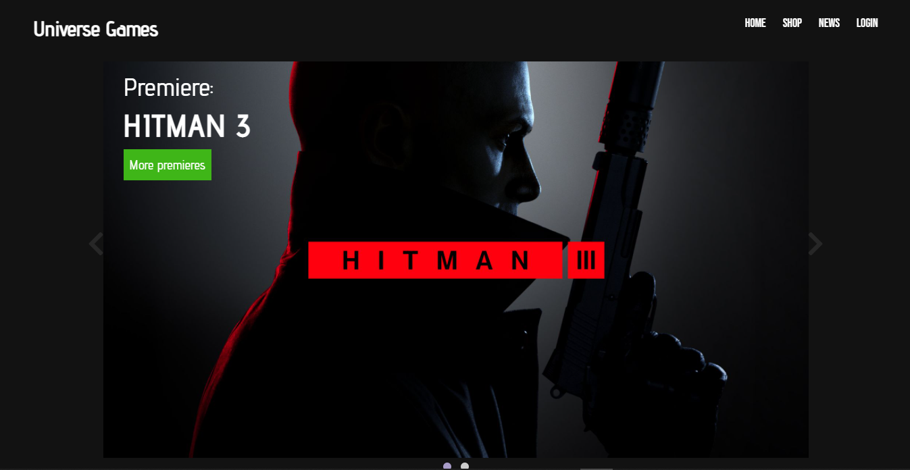
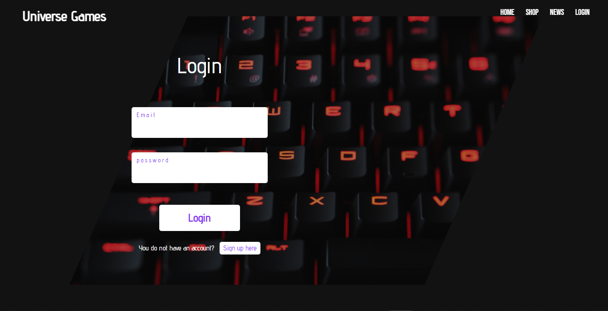
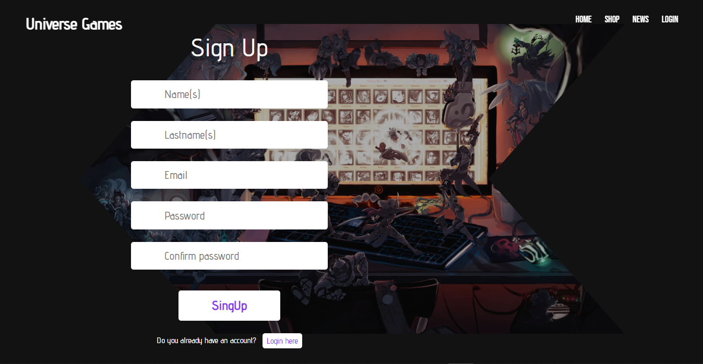
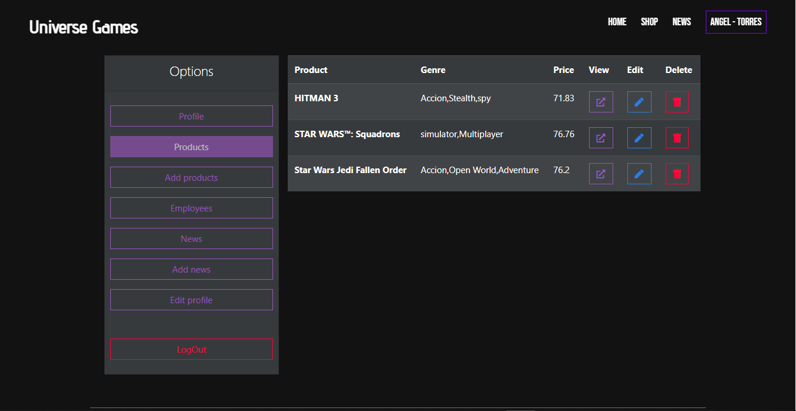
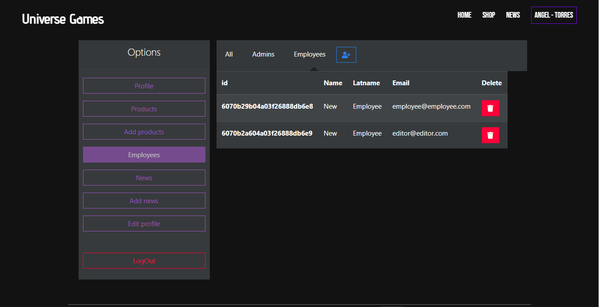
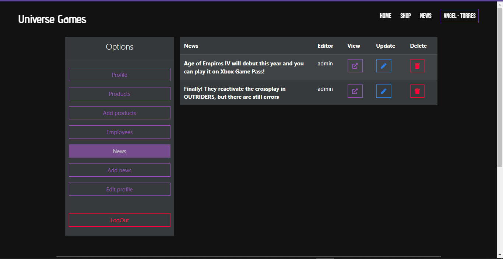

# Universe Games

## Screenshots







## Built with

* [MongoDB](https://www.mongodb.com/cloud) - Data base
* [Cloudinary](https://cloudinary.com/) - Cloud images service
* [NodeJs](https://nodejs.org/es/) - Runtime environment

## Installation guide

---

**Install dependencies with npm**

```bash
npm install
```

**Install the following development dependencies**

```bash
npm install dotenv nodemon -D
```

**Install HandlebarsJs version 4.5.3 to ensure proper operation**

```bash
npm install handlebars@4.5.3
```

**Run the project (go to [localhost: 4000] (http: // localhost: 4000) to view the page)**

```bash
npm run dev
```

Add cloudinary api keys as environment variables in your ".env" file with the following names:

```jsx
API_SECRET=
API_KEY=
CLOUDNAME=
```

Add mongo URI as environment variable:

```jsx
MONGODB_URI= 
```
